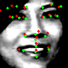
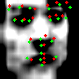
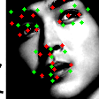
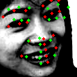

## 运行文件

1. 数据列表生成文件

```python
generate_train_test_list.py
```

2. 数据生成文件

```python
data_tang.py
```

3. 训练文件

```python
detector_tang.py
```

4. 预测文件

```python
predict_tang.py
```

预测文件的部分输出结果如下：

    

  

## 软件版本

Python--3.6.8

OpenCV--3.3.1

PyTorch--1.0.1